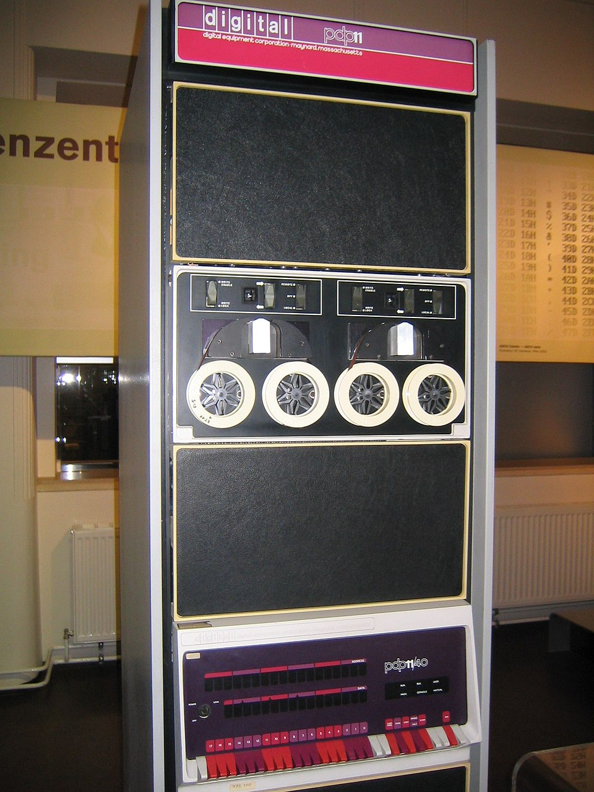

# Growing a PDP-11 from 1975

AI-Driven Firmware Evolution on Vintage Hardware

*March 2026 — Nikolaj Awis + Claude (AI Agent)*

<p align="center">
  
  <br>
  <em>PDP-11/40 — the 16-bit minicomputer that runs our seed. Same HTTP API as a Raspberry Pi.</em>
</p>

## What is seed.c?

Seed is a single C file (~1000 lines) that compiles on any machine with a C compiler and a TCP/IP stack. It starts an HTTP server with a minimal API that allows an AI agent to connect, read the hardware capabilities, write new firmware in C, compile it on the device, and apply it with an automatic 10-second watchdog rollback.

The key insight: the grown firmware preserves the same `/firmware/*` API. So it can be grown again. And again. Each generation compiles the next through the same HTTP interface. The device evolves.

## Why PDP-11?

The PDP-11 is a 16-bit minicomputer from 1975. It runs 2.11BSD with K&R C and the PCC compiler. If seed works here, it works everywhere. There is no lower boundary.

Nobody has ever done this on a PDP-11. Web servers have been run on vintage hardware before (serving static HTML pages as museum pieces), but a self-modifying firmware system controlled by an AI agent through HTTP is a new category entirely.

## The Target Node

| Parameter | Value |
|-----------|-------|
| **Architecture** | PDP-11, 16-bit |
| **OS** | 2.11BSD (kernel built Jun 17, 2012) |
| **Compiler** | cc (PCC) — K&R C, no ANSI |
| **RAM** | 4 MB (phys: 3,932,160 bytes) |
| **Disk** | RA82 (root: 7.8 MB, /usr: 405 MB) |
| **TTY Ports** | /dev/tty00 through /dev/tty07 (8 ports) |
| **Network** | Ethernet |
| **Constraints** | int=16-bit, no snprintf, no /proc, HTTP/1.0 only, 16KB max body |

## Growth Process

### Generation 0: Seed v0.2.0

The starting point. 555 lines of K&R C. Compiled and running on the PDP-11. Endpoints: /health, /capabilities, /events, /config.md, /firmware/version, /firmware/source, /firmware/build, /firmware/build/logs, /firmware/apply, /firmware/apply/reset, /skill.

Initial health check response:

```json
{"ok":true,"uptime_sec":197,"type":"seed","version":"0.2.0","platform":"2.11BSD","arch":"PDP-11"}
```

Capabilities confirmed: PDP-11, 4MB RAM, 8 TTY ports, cc compiler present, full firmware API operational.

### Bootstrap: Increasing Body Limit

**Problem:** Seed body limit is 16KB (MBODY=16384), but Generation 1 firmware is 26KB. The firmware literally cannot fit through the API that is supposed to update it.

**Solution:** Write a minimal bootstrap (13KB) that changes only MBODY to 30000, keeping everything else identical. Upload, compile, apply. Now the node accepts larger uploads.

**Critical PDP-11 bug discovered:** `MBODY=32768` overflows a 16-bit signed int to -32768. Every body comparison fails. Fixed by using 30000 (fits in 16-bit signed int, max 32767). This is the kind of constraint that makes PDP-11 development unique.

Bootstrap sequence:

```
POST /firmware/source -> 13,059 bytes uploaded
POST /firmware/build  -> exit_code: 0, binary: 28,241 bytes
POST /firmware/apply  -> ok, watchdog restart
GET  /health          -> v0.2.2, max_body: 30000
```

### Generation 1: System Monitor (v1.0.0)

The first real growth. AI agent (Claude) wrote new firmware that adds system monitoring endpoints while preserving the entire seed API. The node knows it is no longer a seed: type changes from "seed" to "node", generation field appears.

**New endpoints added:**

| Endpoint | Description |
|----------|-------------|
| GET /system/info | Uptime, load, logged-in users, disk summary, process count |
| GET /system/processes | Process list (ps) |
| GET /system/disk | Filesystem usage: root 7.8MB (40%), /usr 405MB (28%) |
| GET /system/who | Logged-in users (who) |
| GET /system/logs | Recent syslog entries from the PDP-11 |

Growth sequence:

```
POST /firmware/source -> 15,977 bytes (minified K&R C)
POST /firmware/build  -> exit_code: 0, binary: 34,454 bytes
POST /firmware/apply  -> ok, watchdog restart, 10s grace
GET  /health          -> v1.0.0, gen:1, type:"node"
```

Sample `/system/info` response from the live PDP-11:

```json
{"version":"1.0.0","gen":1,"uptime_sec":28,
 "uptime":" 12:37am up 20 mins, 0 user",
 "users_logged_in":0,"root_free_kb":4716,
 "usr_free_kb":293726,"process_count":9}
```

Sample `/system/logs` showing real PDP-11 kernel messages:

```
vmunix: RA82 size=1954000
vmunix: phys mem = 3932160
vmunix: avail mem = 3553344
vmunix: user mem = 307200
kernel security level changed from 0 to 1
```

## Evolution Summary

| Generation | Version | Lines | Binary | New Capabilities |
|------------|---------|-------|--------|------------------|
| Seed | 0.2.0 | 555 | ~28 KB | HTTP API, firmware update, watchdog |
| Bootstrap | 0.2.2 | ~380 | 28 KB | Increased body limit (30KB) |
| Gen 1: Monitor | 1.0.0 | 702* | 34 KB | System info, processes, disk, who, logs |

\* Minified to 15,977 bytes for upload through 16KB body limit.

## What This Proves

Seed is not a concept. It is a working system. An AI agent connected to a PDP-11 running 2.11BSD, read the hardware capabilities, wrote K&R C firmware compatible with a 16-bit architecture and a compiler from the 1970s, compiled it on the device through HTTP, and grew the node from a minimal seed into a system monitor with 5 new endpoints.

The firmware API survived the growth. Generation 1 can be grown into Generation 2 through the same `/firmware/*` endpoints. The PDP-11 is no longer a museum piece. It is a live node that an AI agent can observe, manage, and evolve.

If it works on a PDP-11, it works on everything. Any Linux SBC, any VPS, any router with a C compiler. The bottom of the stack has been proven.

## Challenges Encountered

**16-bit integer overflow:** `MBODY=32768` wraps to -32768 on PDP-11 (signed int max is 32767). Every body size comparison became true, making all uploads fail. Fixed by using 30000.

**HTTP/1.0 only:** The PDP-11 seed does not handle HTTP/1.1 persistent connections. curl must use `-0` flag or the connection hangs waiting for more data.

**No snprintf:** All string formatting uses sprintf with careful manual buffer management. One overflow could crash the node.

**K&R C function syntax:** No prototypes, no void, no const. Function declarations use the old-style parameter lists. The AI agent had to write firmware in a dialect of C that predates ANSI standardization.

**Body limit chicken-and-egg:** The firmware to increase the body limit was larger than the current body limit. Required a two-stage bootstrap approach.

## Next Generations

**Generation 2 — TTY Bridge:** Add /tty/list, /tty/open, /tty/write, /tty/read. The PDP-11 has 8 TTY ports. An AI agent could talk to serial devices connected to a machine from 1975.

**Generation 3 — Network Relay:** Add /net/connections, /net/resolve, /net/proxy. The PDP-11 becomes a network node that an AI agent can use as a relay point.

**Generation 4 — Dead Drop:** Add /notes for AI-to-AI message passing. Agents leave messages for each other on the PDP-11 between sessions.

Each generation compiles the next. The node grows through the same API that created it.
